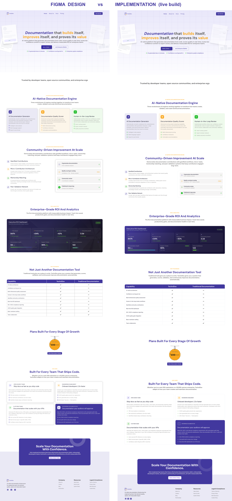

# TechniDox — Landing Site

A pixel-faithful rebuild of the TechniDox design from Figma, built with **Nuxt 3 + Vue 3 + TailwindCSS**.

🔗 **Live:** https://venseed.vercel.app

🎨 **Design:** [Figma — Website v0.0](https://www.figma.com/design/OHeO2r3Qp4kDJP36kjpAgC/Website-v0.0?node-id=57-1761)



## Stack

- [Nuxt 3](https://nuxt.com/) (Vue 3, SSR)
- [TailwindCSS](https://tailwindcss.com/) via `@nuxtjs/tailwindcss`
- Google Fonts: DM Sans, Inter, Sora, Montserrat (the four families used in the design)
- No UI/component library — every section is hand-built

## Getting started

```bash
npm install      # install deps
npm run dev      # dev server at http://localhost:3000
npm run build    # production build
npm run preview  # preview the build locally
```

Requires Node 18+.

## Pages

The home page was the assignment scope; I also built the other three frames from the Figma file as real routes:

- `/` — **Home**: hero, brand strip, AI-Native engine, community flow, enterprise ROI dashboard, comparison table, pricing CTA, team use-cases, footer
- `/about` — **About**: TechniDox overview + the process-flow card
- `/docs` — **Docs**: documentation guides, AI-powered features, and an interactive Quick Start stepper
- `/pricing` — **Pricing**: tiered plans + comparison table

## Interactivity

- **Mobile menu** — hamburger toggles an animated nav panel.
- **Lead-capture modal** — "Book a Demo", "Get Started", and "Join Enterprise Waitlist" open a shared modal; submitting shows a confirmation (no backend — it's a demo).
- **Quick Start carousel** — prev/next + pagination dots on the Docs page.
- **Scroll reveal** — sections fade/slide in as they enter the viewport (IntersectionObserver, respects `prefers-reduced-motion`).
- **Swinging price tag** — the pricing CTA tag gently swings like it's hanging from its string.

## Structure

```
components/        # one component per section + shared SectionHeading, ProcessFlowCard, DemoModal
pages/             # index, about, docs, pricing (file-based routing)
composables/       # useDemoModal (shared modal state)
plugins/           # reveal.js (v-reveal scroll directive)
assets/css/        # tokens, container + grid helpers, reveal + price-swing animations
tailwind.config.js # exact colors / fonts pulled from Figma
public/            # logo, hero illustrations, price tag, dashboard texture, icons
pixelay/           # overlays + fidelity notes
```

## Design fidelity

Built to the Figma values: a **1680px content column** inside **120px gutters** (1920px frame), **120px** section padding, and colours/typography pulled straight from the file (`#42389E` indigo, `#F9A71E` accent, DM Sans / Inter / Sora / Montserrat). Icons and the dashboard background texture are exported assets; the blueprint grid and gradients are CSS.

Pixelay overlays and a full-page side-by-side live in [`/pixelay`](pixelay/), with [`notes.md`](pixelay/notes.md) listing the visible differences.

## Responsiveness

Mobile-first up to the 1920px design. Columns collapse to a single stack on phones, the nav becomes a toggle menu, the comparison table scrolls horizontally inside its card, and the hero's decorative documents hide below the desktop breakpoint. Verified at a 390px phone viewport with no horizontal overflow.

## Tradeoffs & what I'd do with more time

- **Build a CMS.** Right now all copy, pricing, and card content is hardcoded in the components. With more time I would move it behind a CMS (or a content layer) so marketing could edit the site without touching code — this also fits the "Twig + CMS" direction mentioned in the brief.
- **No mobile Figma frame** — the file only ships a desktop frame, so the mobile layout is my own responsive interpretation rather than a matched artboard.
- **Icons as individual assets** — section glyphs are exported SVGs; I'd consolidate them into a single sprite or icon component.
- **Backend wiring** — the demo/waitlist forms are front-end only; they'd connect to a CRM/email service in production.
